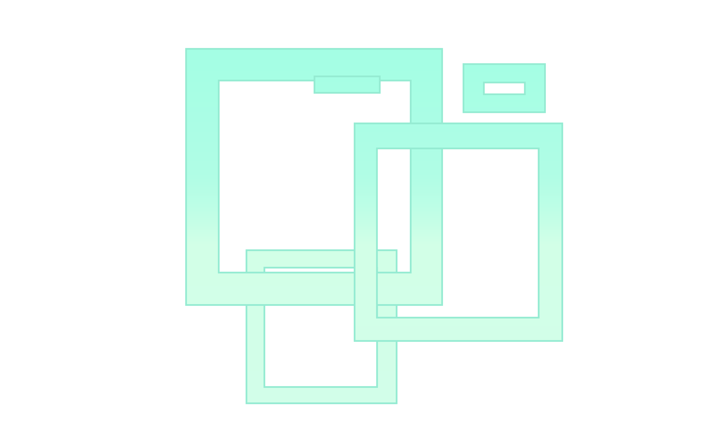

# html快速入门

## html文件结构

```html
<!DOCTYPE html>
<html>
  <head>
    <meta charset="utf-8" />
    <meta name="description" content="html 快速入门" />
    <meta name="keywords" content="hduoaiehuo" />
    <title>html 快速入门</title>
    <link rel="icon" href="./images/icon.png" />
  </head>

  <body>
    <!-- html的注释 -->
    <span><mark>hello</mark></span>
    <div><strong>world</strong></div>
    
    
    
  </body>
</html>
```

​     

## 图片

```html
    
```

## 音频

```html
    <audio controls src="./audios/bgm.mp3">无法播放</audio>
```


```html
    <audio controls>
      <source src="./audios/sound1.mp3" type="audio/mpeg" />
      <source src="./audios/sound2.mp3" type="audio/mpeg" />
    </audio>
```

## 视频

```html
    <video controls width="300" src="./videos/video1.mp4"></video>
```


```html
    <video controls width="300">
      <source src="./videos/video1.mp4" type="video/mp4" />
      <source src="./videos/video2.mp4" type="video/mp4" />
    </video>
```

## 超链接

```html
    <a href="https://github.com/neKoui1">MyGithub</a>
```

​    <a href="https://github.com/neKoui1">MyGithub</a>

使用`target="_blank"`，可以弹出一个新页面而不用在当前页面跳转

```html
<a href="https://github.com/neKoui1" target="_blank">MyGithub</a>
```

在超链接中同样可以使用图片跳转

## 表单

```html
    <h2>Form</h2>
    <form>
      <label for="username">用户名</label>
      <input
        type="text"
        name="username"
        manlength="10"
        minlength="3"
        id="username"
        placeholder="username"
      />

      <br />
      <label for="age">年龄</label>
      <input required type="number" name="age" id="age" placeholder="age" />

      <br />
      <label for="email">邮箱</label>
      <input type="email" name="email" id="email" />

      <br />
      <label for="password">密码</label>
      <input type="password" name="password" id="password" />

      <br />
      <label for="lang">cpp</label>
      <input type="radio" name="lang" value="cpp" id="cpp" />
      <label for="java">java</label>
      <input type="radio" name="lang" value="java" id="java" />
      <label for="lang">python</label>
      <input type="radio" name="lang" value="python" id="python" />

      <br />
      <label for="resume">用户名</label>
      <textarea name="resume" id="resume" rows="10" cols="30"> </textarea>

      <br />
      <label for="language">语言</label>
      <select name="language" id="language">
        <option value="">请选择</option>
        <option selected value="cpp">cpp</option>
        <option value="java">java</option>
        <option value="python">python</option>
      </select>

      <br />
      <button type="submit">提交</button>
    </form>
```


## 列表

```html
    <h2>unordered list</h2>
    <ul>
      <li>1</li>
      <li>2</li>
      <li>3</li>
    </ul>

    <h2>ordered list</h2>
    <ol>
      <li>1</li>

      <li><a href="https://www.runoob.com/" target="_blank">2</a></li>
      <li>3</li>
    </ol>
```


**HTML `<dl>` 元素** （或 *HTML* *描述列表元素*）是一个包含术语定义以及描述的列表，通常用于展示词汇表或者元数据 (键 - 值对列表)。

```html
    <h2>definition list</h2>
    <dl>
      <dt>NAME</dt>
      <dd>reahufio</dd>
      <dt>AGE</dt>
      <dd>2000</dd>
    </dl>
```


