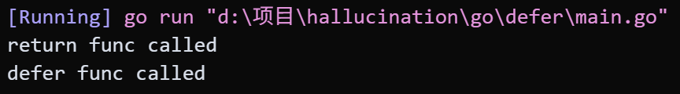
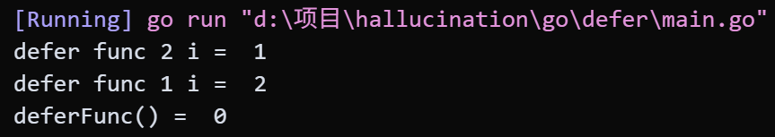
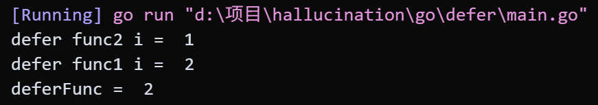
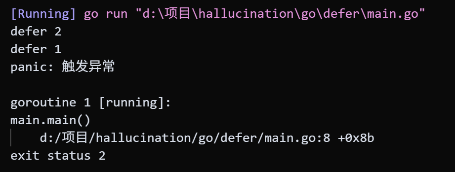
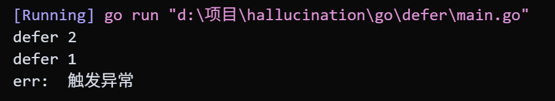

# defer和return的执行顺序

## 1. defer的执行顺序

*LIFO* defer的后面只能跟函数

## 2. defer和return的执行顺序

return会先执行，defer会后执行

```go
package main

import "fmt"

func deferFunc() {
	fmt.Println("defer func called")
}

func returnFunc() int {
	fmt.Println("return func called")
	return 1
}

func returnAndDefer() int {
	// 后执行
	defer deferFunc()
	// 先执行
	return returnFunc()
}

func main() {
	returnAndDefer()
}

```

*Output*

```shell
return func called
defer func called
```



## 3. defer和无命名返回值的函数

go在return时，会执行一个类似创建`temp := i`的临时变量保存return的操作，因此在下列函数中会先确认返回值为0，后续的defer对i的修改不会影响到return的temp值

在defer时按照后进先出顺序先执行`defer func2 i = 1`和`defer func1 = 2`

之后在退出函数体返回到主函数执行主函数中println时得到的返回值是之前保存的临时变量0

```go
package main

import "fmt"

func deferFunc() int {
	var i int
	defer func() {
		i++
		fmt.Println("defer func 1 i = ", i)
	}()

	defer func() {
		i++
		fmt.Println("defer func 2 i = ", i)
	}()

	return i
}

func main() {
	fmt.Println("deferFunc() = ", deferFunc())
}

```

*Output*

```shell
defer func 2 i =  1
defer func 1 i =  2
deferFunc() =  0
```



## 4. defer和有命名返回值的函数

执行return时先执行返回值的保存操作，后续的defer将能够修改这个返回值，因此println的值为2

```go
package main 
import "fmt" 
func deferFunc() (i int) {
 defer func() {
 i++
 fmt.Println("defer func1 i = ", i)
 }() 
defer func() {
 i++
 fmt.Println("defer func2 i = ", i)
 }()
 return i
} 
func main() {
 fmt.Println("deferFunc = ", deferFunc())
}
```

*Output*

```shell
defer func2 i =  1
defer func1 i =  2
deferFunc =  2
```



## 5. defer和panic的执行顺序

**当panic发生时，会先执行所有已经注册的defer语句，之后才会终止程序或者向上传播panic**

1. **panic触发**：执行panic()时程序不会立即终止，而是进入异常处理阶段

2. **执行defer**：按照*LIFO*顺序执行当前函数中所有已经注册的defer语句（panic发生之前声明的defer）

3. **panic传播**：在当前函数中的所有defer执行完毕后，panic会向上传播到调用栈的上一层函数，重复以上步骤，在栈顶处程序崩溃

```go
package main

import "fmt"

func main() {
	defer fmt.Println("defer 1")
	defer fmt.Println("defer 2")
	panic("触发异常")
	defer fmt.Println("defer 3")
}
```

*Output*

```shell
defer 2
defer 1
panic: 触发异常

goroutine 1 [running]:
main.main()
	d:/项目/hallucination/go/defer/main.go:8 +0x8b
exit status 2
```

 

## 6. defer中包含panic

```go
package main

import "fmt"

func main() {
	defer func() {
		fmt.Println("defer 1")
		if err := recover(); err != nil {
			fmt.Println("err: ", err)
		}
	}()
	defer func() {
		fmt.Println("defer 2")
	}()
	panic("触发异常")
	defer func() {
		fmt.Println("defer 3")
	}()
}

```

*Output*

```shell
defer 2
defer 1
err:  触发异常
```



## 7. defer和os.Exit

```go
package main
​
import (
  "fmt"
  "os"
)
​
func test1() {
  fmt.Println("test")
}
​
func main() {
  fmt.Println("main start")
  defer test1()
  fmt.Println("main end")
  os.Exit(0)
}
```

函数因为执行了os.Exit退出，程序立即终止，被defer的函数调用不会执行
