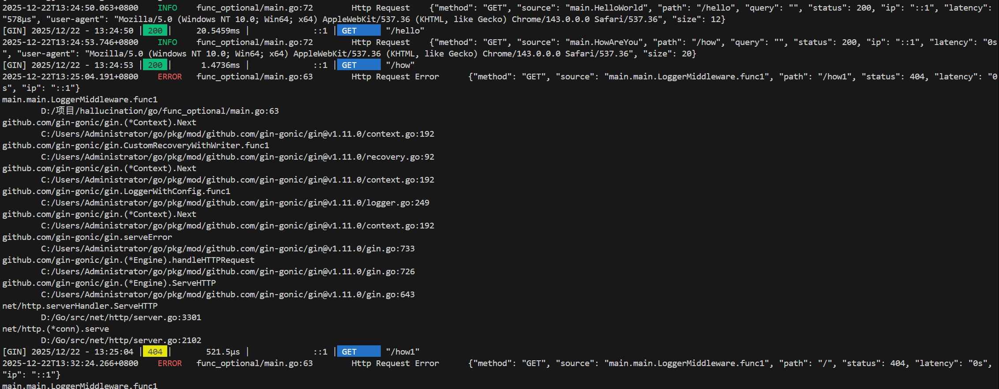

# 函数选项模式

```go
package main

import (
    "fmt"
    "time"
)

type Server struct {
    Addr         string
    Port         string
    ReadTimeOut  time.Duration
    WriteTimeOut time.Duration
    Timeout      time.Duration
}

type Option func(*Server)

func WithAddr(addr string) Option {
    return func(s *Server) {
        s.Addr = addr
    }
}

func WithPort(port string) Option {
    return func(s *Server) {
        s.Port = port
    }
}

func WithReadTimeOut(t time.Duration) Option {
    return func(s *Server) {
        s.ReadTimeOut = t
    }
}

func WithWriteTimeOut(t time.Duration) Option {
    return func(s *Server) {
        s.WriteTimeOut = t
    }
}

func WithTimeout(t time.Duration) Option {
    return func(s *Server) {
        s.Timeout = t
    }
}

func NewServer(options ...Option) *Server {
    srv := &Server{
        Addr:         "localhost",
        Port:         ":8080",
        ReadTimeOut:  2 * time.Second,
        WriteTimeOut: 2 * time.Second,
        Timeout:      4 * time.Second,
    }
    for _, option := range options {
        option(srv)
    }
    return srv
}

func main() {
    srv := NewServer()
    fmt.Println(srv)
    srv2 := NewServer(
        WithAddr("192.168.0.0.1"),
        WithPort(":9090"),
    )
    fmt.Println(srv2)
}
```

# 装饰器模式

```go
package main

import (
    "fmt"
    "log"
    "net/http"
    "time"
)

// 装饰器模式
type Handler func(w http.ResponseWriter, r *http.Request)

func Logger(handler Handler) Handler {
    return func(w http.ResponseWriter, r *http.Request) {
        now := time.Now()
        handler(w, r)
        log.Printf("url: %s, elapse: %v\n", r.URL, time.Since(now))
    }
}

func HelloWorld(w http.ResponseWriter, r *http.Request) {
    now := time.Now()

    w.WriteHeader(http.StatusOK)
    w.Write([]byte("Hello World!"))

    log.Printf("url: %s, elapse: %v", r.URL, time.Since(now))
}

func HowAreYou(w http.ResponseWriter, r *http.Request) {
    w.WriteHeader(http.StatusOK)
    w.Write([]byte("I am fine"))
}

func main() {
    mux := http.NewServeMux()
    mux.HandleFunc("GET /hello", HelloWorld)
    mux.HandleFunc("GET /how", Logger(HowAreYou))
    srv := http.Server{
        Addr:    ":8080",
        Handler: mux,
    }
    fmt.Println("listen at ", srv.Addr)
    srv.ListenAndServe()
}
```

# 和中间件比较

```go
package main

import (
	"net/http"
	"time"

	"github.com/gin-gonic/gin"
	"go.uber.org/zap"
	"go.uber.org/zap/zapcore"
)

func InitLogger() *zap.Logger {
	config := zap.NewDevelopmentConfig()
	config.EncoderConfig.TimeKey = "timestamp"
	config.EncoderConfig.EncodeTime = zapcore.ISO8601TimeEncoder
	config.EncoderConfig.MessageKey = "message"
	config.EncoderConfig.LevelKey = "level"
	config.EncoderConfig.CallerKey = "caller"
	// 颜色配置 - 选择以下之一：
	// zapcore.LowercaseLevelEncoder          // 小写无颜色: "info"
	// zapcore.LowercaseColorLevelEncoder     // 小写带颜色: "info" (彩色)
	// zapcore.CapitalLevelEncoder            // 大写无颜色: "INFO"
	// config.EncoderConfig.EncodeLevel = zapcore.CapitalColorLevelEncoder // 大写带颜色: "INFO" (彩色)
	config.EncoderConfig.EncodeLevel = func(level zapcore.Level, encoder zapcore.PrimitiveArrayEncoder) {
		switch level {
		case zapcore.DebugLevel:
			encoder.AppendString("\033[36mDEBUG\033[0m")
		case zapcore.InfoLevel:
			encoder.AppendString("\033[32mINFO\033[0m")
		case zapcore.WarnLevel:
			encoder.AppendString("\033[33mWARN\033[0m")
		case zapcore.ErrorLevel:
			encoder.AppendString("\033[31mERROR\033[0m")
		case zapcore.FatalLevel:
			encoder.AppendString("\033[35mFATAL\033[0m")
		default:
			encoder.AppendString(level.CapitalString())
		}
	}

	logger, err := config.Build()
	if err != nil {
		panic("failed to initialize logger: " + err.Error())
	}
	return logger
}

func LoggerMiddleware(logger *zap.Logger) gin.HandlerFunc {
	return func(c *gin.Context) {
		start := time.Now()
		path := c.Request.URL.Path
		query := c.Request.URL.RawQuery
		method := c.Request.Method
		ip := c.ClientIP()
		userAgent := c.Request.UserAgent()

		c.Next()

		latency := time.Since(start)
		statusCode := c.Writer.Status()

		if statusCode >= 400 {
			logger.Error("Http Request Error",
				zap.String("method", method),
				zap.String("source", c.HandlerName()),
				zap.String("path", path),
				zap.Int("status", statusCode),
				zap.Duration("latency", latency),
				zap.String("ip", ip),
			)
		} else {
			logger.Info("Http Request",
				zap.String("method", method),
				zap.String("source", c.HandlerName()),
				zap.String("path", path),
				zap.String("query", query),
				zap.Int("status", statusCode),
				zap.String("ip", ip),
				zap.Duration("latency", latency),
				zap.String("user-agent", userAgent),
				zap.Int("size", c.Writer.Size()),
			)
		}
	}
}

func HelloWorld(c *gin.Context) {
	c.String(http.StatusOK, "Hello World!")
}

func HowAreYou(c *gin.Context) {
	c.JSON(http.StatusOK, gin.H{
		"msg": "I am fine.",
	})
}

func main() {
	logger := InitLogger()
	defer logger.Sync()

	r := gin.Default()
	r.Use(LoggerMiddleware(logger))
	r.GET("/hello", HelloWorld)
	r.GET("/how", HowAreYou)
	if err := r.Run(":8080"); err != nil {
		logger.Fatal("Failed to start server", zap.Error(err))
	}
}


```




