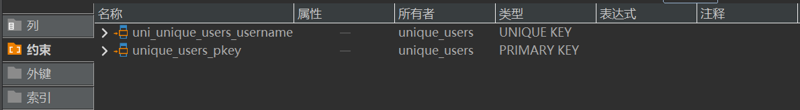
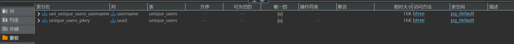
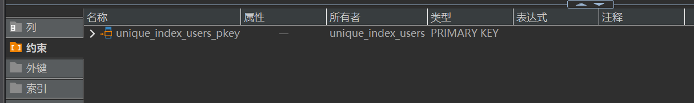
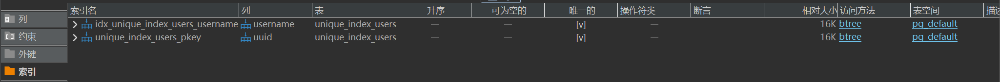

主要使用的是pgsql

# unique和uniqueIndex的区别

编写单元测试`uniqueIndex_test.go`如下

```go
package test

import (
    "testing"

    "github.com/google/uuid"
)

type UniqueUser struct {
    UUID     uuid.UUID `gorm:"column:uuid;type:uuid;primaryKey;default:gen_random_uuid();"`
    Username string    `gorm:"column:username;type:varchar(20);not null;unique"`
}

type UniqueIndexUser struct {
    UUID     uuid.UUID `gorm:"column:uuid;type:uuid;primaryKey;default:gen_random_uuid();"`
    Username string    `gorm:"column:username;type:varchar(20);not null;uniqueIndex"`
}

func TestUniqueIndex(t *testing.T) {
    db.AutoMigrate(
        &UniqueUser{},
        &UniqueIndexUser{},
    )
    u1 := &UniqueUser{
        Username: "unique_user_1",
    }
    u2 := &UniqueIndexUser{
        Username: "unique_index_user_1",
    }
    if err := db.Create(u1).Error; err != nil {
        t.Errorf("fail to create unique user: %v", err)
        return
    }
    if err := db.Create(u2).Error; err != nil {
        t.Errorf("fail to create unique index user: %v", err)
        return
    }
}
```

对两张数据表使用不同的tag: unique和uniqueIndex

automigrate后如下查看数据表中的约束和索引创建如下：

`unique_users`





`unique_index_users`





可以发现两个tag都同样为username生成了索引，但是在约束方面unique比uniqueIndex多生成了一个`uni_unique_users_username`

## 1. 约束层面

`unique`

* 创建唯一约束：在数据库层面创建`unique constraint`

* ORM自动生成约束名`uni_unique_users_username`

* 在违反唯一性时，数据库会抛出约束违反错误

`uniqueIndex`

* 创建唯一索引：在数据库层面创建`unique index`

* ORM自动生成索引名

* 数据库同样保证唯一性，但是实现的方式不同

## 2. 数据库层面的实现差异

`unique`

```sql
-- 约束
uni_unique_users_username (UNIQUE CONSTRAINT)
unique_users_pkey (PRIMARY KEY CONSTRAINT)

-- 索引
uni_unique_users_username (UNIQUE INDEX)
unique_users_pkey (PRIMARY KEY INDEX)
```

`uniqueIndex`

```sql
-- 约束
unique_index_users_pkey (PRIMARY KEY CONSTRAINT)

-- 索引
idx_unique_index_users_username (UNIQUE INDEX)
unique_index_users_pkey (PRIMARY KEY INDEX)
```

## 3. 索引和约束

* 约束定义数据的完整性要求

* 索引是一种数据结构，用于提升查询性能

* 唯一约束：会自动创建对应的唯一索引

* 唯一索引：直接创建索引，隐式保证唯一性

## 4. 使用场景

`unique`

```go
type User struct {
    ID       uint   `gorm:"primaryKey"`
    Email    string `gorm:"unique"`        // 业务逻辑要求唯一
    Username string `gorm:"unique"`        // 业务逻辑要求唯一
}
```

* 需要保证业务逻辑唯一性的情况：Email，Username

* 数据完整性比查询性能更加重要

* 数据库设计文档化约束关系

`uniqueIndex`

```go
type Order struct {
    ID        uint   `gorm:"primaryKey"`
    OrderNo   string `gorm:"uniqueIndex"`  // 主要用于查询优化
    UserID    uint   `gorm:"uniqueIndex:idx_user_order"` // 复合唯一索引
    ProductID uint   `gorm:"uniqueIndex:idx_user_order"`
}
```

* 需要保证查询的性能优化

* 需要复合唯一性约束

* 查询性能是最主要的考虑因素
